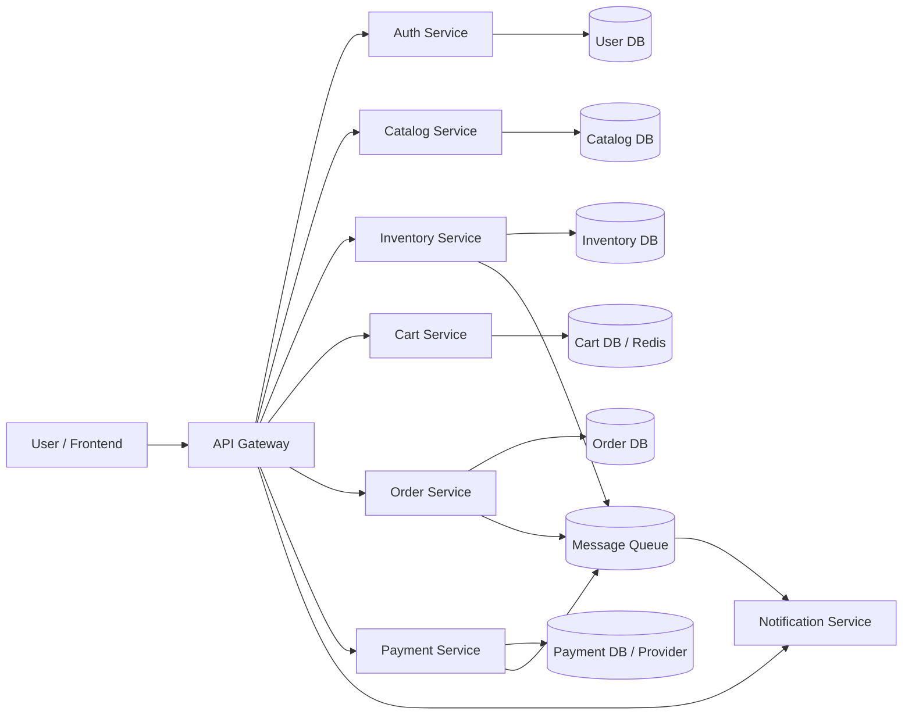

# eCommerce Platform

This repository is being rebuilt from a fresh starting point. The first service is a Catalog Service that stores product information and exposes APIs for listing and reading products.

## High-Level Design

Start with a small, working system and grow it into microservices as the domain becomes clearer. For the first version, a modular monolith or a few simple services is easier to build, test, and understand than many distributed services.

## MVP Capabilities

- Browse products.
- View product details.
- Store product descriptions, prices, categories, and stock quantities.
- Support checkout later by allowing stock to be read and eventually reduced.
- Keep order, payment, cart, and user services as planned future modules.

## Suggested Services

- API Gateway: Single entry point for frontend requests.
- Auth/User Service: Signup, login, user profile, and token handling.
- Catalog Service: Product title, description, images, category, brand, and price.
- Inventory Service: Stock quantity, availability, reserve stock, and release stock.
- Cart Service: Temporary shopping cart before checkout.
- Order Service: Order creation, order status, and order history.
- Payment Service: Payment initiation and confirmation.
- Notification Service: Email or SMS confirmation.
- Admin Service: Product and stock management for internal users.

## First Version Scope

The first build starts with the Catalog Service only. It includes product data and stock quantity so the application can show complete product information immediately. Later, stock ownership can move into a dedicated Inventory Service.

## Architecture Workflow



## Service Ownership

- Catalog Service answers: What is the product?
- Inventory Service answers: How many units are available?
- Cart Service answers: What does the user want to buy?
- Order Service answers: What was purchased?
- Payment Service answers: Did payment succeed?
- Notification Service answers: Who needs to be informed?

## Purchase Workflow

1. User opens the product listing page.
2. Frontend calls Catalog Service for product data.
3. User opens one product and reads details.
4. User adds product to cart.
5. Cart Service stores selected items.
6. User checks out.
7. Order Service creates a pending order.
8. Inventory Service checks stock.
9. Inventory Service reserves or deducts stock.
10. Payment Service processes payment.
11. Order Service marks the order as confirmed.
12. Notification Service sends confirmation.

## Stock Handling

For the final architecture, prefer reserve-then-confirm:

- Reserve stock when checkout starts.
- Confirm stock deduction after payment succeeds.
- Release stock if payment fails or the checkout expires.

For this first Catalog Service, stock quantity remains in the product table so the API is useful immediately.

## Build Order

1. Catalog Service.
2. Inventory Service.
3. Order Service.
4. Auth/User Service.
5. Cart Service.
6. Payment flow.
7. Notification Service.
8. Admin product management.
9. Search, recommendations, reviews, and analytics.

## Current Catalog Service

The current service uses FastAPI and SQLite.

### Run Locally

```bash
python -m venv .venv
source .venv/bin/activate
pip install -r requirements.txt
uvicorn app.main:app --reload
```

### API Endpoints

- `GET /health`: Service health check.
- `GET /products`: List all active products.
- `GET /products?category=electronics`: Filter by category.
- `GET /products?search=phone`: Search by name or description.
- `GET /products/{product_id}`: Read one product.
- `POST /products`: Create a product.
- `PATCH /products/{product_id}/stock`: Update product stock quantity.

## Project Structure

```text
app/
  main.py
  database.py
  models.py
  schemas.py
  seed.py
  routes/
    products.py
data/
  catalog.db
tests/
requirements.txt
```
.