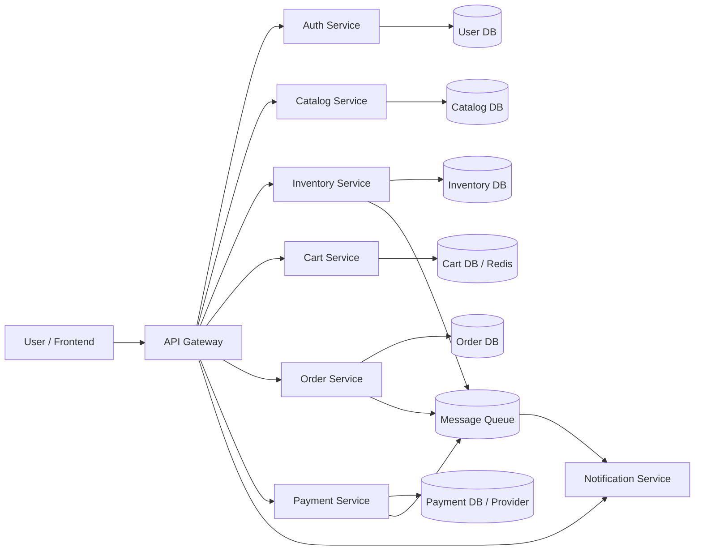

# eCommerce Platform

This repository is being rebuilt from a fresh starting point. It currently contains Catalog, Inventory, Order, Auth/User, and Cart services. Product data is imported from the DummyJSON Products API.

## High-Level Design

Start with a small, working system and grow it into microservices as the domain becomes clearer. For the first version, a modular monolith or a few simple services is easier to build, test, and understand than many distributed services.

## MVP Capabilities

- Browse products.
- View product details.
- Import product descriptions, images, prices, categories, ratings, and stock from DummyJSON.
- Convert source USD prices to INR during import.
- Create orders and reduce stock for purchased products.
- Register users, authenticate them, and protect user-specific APIs.
- Maintain a separate shopping cart for each authenticated user.
- Keep payment and notification services as planned future modules.

## Suggested Services

- API Gateway: Single entry point for frontend requests.
- Auth/User Service: Signup, login, user profile, and token handling.
- Catalog Service: Product title, description, images, category, brand, and price.
- Inventory Service: Stock quantity, availability, reserve stock, and release stock.
- Cart Service: Temporary shopping cart before checkout.
- Order Service: Order creation, order status, and order history.
- Payment Service: Payment initiation and confirmation.
- Notification Service: Email or SMS confirmation.
- Admin Service: Product and stock management for internal users.

## First Version Scope

The first build keeps the services inside one FastAPI application. Each domain has its own service folder so its API contracts and logic are easy to identify and can later become an independent microservice.

## Architecture Workflow



## Service Ownership

- Catalog Service answers: What is the product?
- Inventory Service answers: How many units are available?
- Cart Service answers: What does the user want to buy?
- Order Service answers: What was purchased?
- Payment Service answers: Did payment succeed?
- Notification Service answers: Who needs to be informed?

## Purchase Workflow

1. User opens the product listing page.
2. Frontend calls Catalog Service for product data.
3. User opens one product and reads details.
4. User adds product to cart.
5. Cart Service stores selected items.
6. User checks out.
7. Order Service creates a pending order.
8. Inventory Service checks stock.
9. Inventory Service reserves or deducts stock.
10. Payment Service processes payment.
11. Order Service marks the order as confirmed.
12. Notification Service sends confirmation.

## Stock Handling

For the final architecture, prefer reserve-then-confirm:

- Reserve stock when checkout starts.
- Confirm stock deduction after payment succeeds.
- Release stock if payment fails or the checkout expires.

For this first implementation, Catalog still exposes stock quantity for product-listing convenience, but Inventory is now the source for stock operations such as setting, reserving, and purchasing stock.

## Build Order

1. Catalog Service.
2. Inventory Service.
3. Order Service.
4. Auth/User Service.
5. Cart Service.
6. Payment flow.
7. Notification Service.
8. Admin product management.
9. Search, recommendations, reviews, and analytics.

## Current Services

The current service uses FastAPI and SQLite.

### Run Locally

```bash
python -m venv .venv
source .venv/bin/activate
pip install -r requirements.txt
export JWT_SECRET="replace-with-a-long-random-secret"
export USD_TO_INR_RATE="95.5"
uvicorn app.main:app --reload
```

Open `http://127.0.0.1:8000` for the storefront or
`http://127.0.0.1:8000/docs` for the API documentation.

### Catalog Import

The app checks for updated DummyJSON products during startup. It refreshes the
catalog once every 24 hours by default and uses
`data/dummyjson_products.json` if the external API is unavailable.

Run a forced import manually:

```bash
python -m app.catalog_import
```

Configuration:

- `USD_TO_INR_RATE`: USD-to-INR conversion rate. Default: `95.5`.
- `DUMMYJSON_SYNC_INTERVAL_HOURS`: Catalog refresh interval. Default: `24`.
- `DUMMYJSON_USE_CACHE_ONLY`: Use the checked-in API snapshot without network access.

Inventory quantities are initialized from DummyJSON during the first import.
Later catalog refreshes preserve local stock changes made by orders.

### API Endpoints

- `GET /health`: Service health check.
- `GET /products`: List all active products.
- `GET /products?category=electronics`: Filter by category.
- `GET /products?search=phone`: Search by name or description.
- `GET /products/{product_id}`: Read one product.
- `POST /products`: Create a product.
- `PATCH /products/{product_id}/stock`: Update product stock quantity.
- `GET /inventory`: List inventory for active products.
- `GET /inventory/{product_id}`: Read inventory for one product.
- `PATCH /inventory/{product_id}`: Set available stock quantity.
- `POST /inventory/{product_id}/reserve`: Reserve stock during checkout.
- `POST /inventory/{product_id}/purchase`: Reduce stock after purchase.
- `GET /orders`: List orders.
- `GET /orders/{order_id}`: Read an order and its items.
- `POST /orders`: Create an order and reduce inventory stock.
- `POST /auth/register`: Register a user.
- `POST /auth/login`: Authenticate and receive a Bearer token.
- `GET /auth/me`: Read the authenticated user's profile.
- `GET /cart`: Read the authenticated user's cart.
- `POST /cart/items`: Add a product to the cart.
- `PATCH /cart/items/{product_id}`: Change a cart item quantity.
- `DELETE /cart/items/{product_id}`: Remove one cart item.
- `DELETE /cart`: Clear the cart.
- `POST /cart/checkout`: Create an order from the authenticated user's cart.

Protected endpoints require:

```text
Authorization: Bearer <access_token>
```

### Create Order Example

```json
{
  "customer_id": "customer-001",
  "items": [
    {
      "product_id": 1,
      "quantity": 2
    }
  ]
}
```

## Project Structure

```text
app/
  main.py
  database.py
  catalog_import.py
  frontend/
    index.html
    styles.css
    app.js
  services/
    catalog/
      routes.py
      schemas.py
    inventory/
      routes.py
      schemas.py
      service.py
    orders/
      routes.py
      schemas.py
    auth/
      routes.py
      schemas.py
      security.py
    cart/
      routes.py
      schemas.py
      service.py
.github/
  workflows/
    ci.yml
data/
  catalog.db
  dummyjson_products.json
tests/
requirements.txt
```

Each service folder has a clear responsibility:

- `catalog`: Product information and product APIs.
- `inventory`: Available, reserved, and sold stock.
- `orders`: Order creation, order history, and purchased items.
- `auth`: User registration, password hashing, login, and JWT authentication.
- `cart`: Authenticated user carts, quantities, and calculated totals.
- `frontend`: Responsive storefront, authentication, cart, and checkout interface.
- `catalog_import.py`: DummyJSON synchronization and USD-to-INR conversion.
- `main.py`: Registers each service with FastAPI.
- `database.py`: Shared database connection and tables for the current modular-monolith stage.
